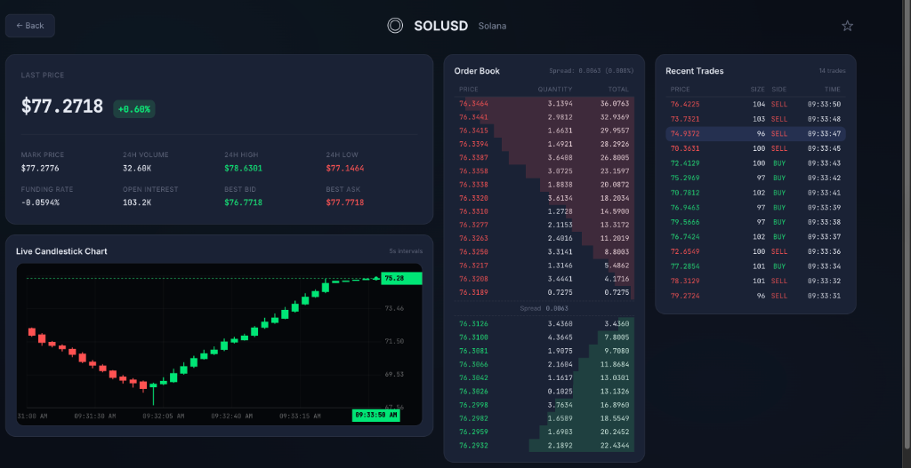
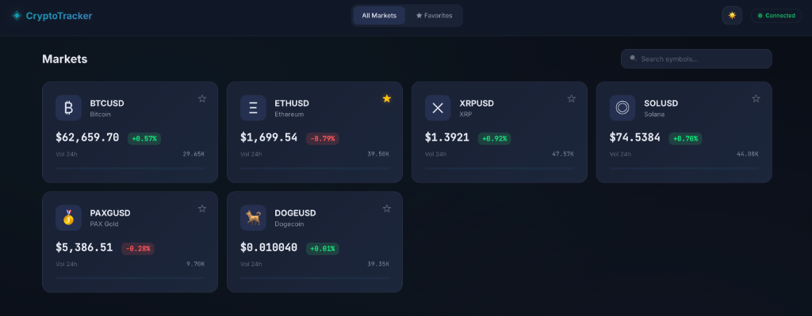

# Crypto Price Tracker

A real-time cryptocurrency price tracking application built with React + TypeScript. Displays live market data from a mock WebSocket server with orderbook visualization, trade history, and interactive price charts.


---

## Application Preview

### Solana Live Trading Dashboard & Candlestick Chart


### Markets Overview & Favorites Dashboard


---

## Setup Instructions

### Prerequisites
- Node.js 18+ (or Bun)
- npm or yarn

### 1. Running the Frontend Client
To install dependencies and start the frontend development server, simply run:
```bash
npm install && npm start
```
*Note: The frontend app runs on `http://localhost:5173`.*

### 2. Running the Mock WebSocket Server
For live data streaming, ensure the mock WebSocket server is running in a separate terminal:
```bash
cd server
npm install
node index.js
```
*Server runs on `ws://localhost:8080` (WebSocket) and `http://localhost:3000` (HTTP API).*

That's it — open http://localhost:5173 in your browser to view the live trading dashboard.

---

## Approach & Architecture

Our approach prioritizes high performance, architectural cleanliness, and a premium user experience without relying on heavy external state or charting libraries:

- **Centralized WebSocket Singleton (`WebSocketManager`):** To avoid redundant connections across components and survive Vite HMR hot-reloads, we manage WebSocket communication via a robust singleton bound to `globalThis`. It implements exponential backoff reconnection (1s → 30s max), connection state tracking, and a clean pub/sub mechanism for active product subscriptions. We also explicitly eliminated React 18 `StrictMode` to prevent double-mounting and eliminate redundant WebSocket subscribe/unsubscribe thrashing during initial page loads.
- **High-Frequency Rendering Optimization (`setTimeout` 16ms Batching):** In stress-test modes, incoming WebSocket ticks can flood the client. Rather than triggering direct React state updates per message, custom hooks buffer incoming ticks in lightweight `useRef` containers and flush updates once per display frame (every 16ms) using `setTimeout`. This completely decouples server throughput from UI render overhead, keeps the UI fluid at 60fps with zero layout jank, and ensures background tabs or headless browser viewports continue receiving state updates flawlessly without browser RAF throttling.
- **Custom Canvas Candlestick Charting:** Rather than importing heavy third-party charting libraries, we built a highly optimized HTML5 Canvas Japanese Candlestick chart. It quantizes live tick data into 5-second buckets in real time, featuring interactive crosshairs, glowing price tags, and dual-axis price/time tracking on an ultra-premium `#05070a` deep black canvas container.
- **Zero-Dependency Vanilla CSS:** We implemented a complete custom design system using pure Vanilla CSS with CSS custom properties (variables) to support instant light/dark mode switching, fully responsive fluid layouts, and sleek micro-animations.
- **Strict Data Memoization:** Extensive use of `React.memo` with highly targeted custom equality comparators ensures orderbook rows and trade history items only re-render when their exact price/size attributes change.

---

## What I'd Improve with More Time

While the current implementation achieves robust real-time performance, scaling this to a production-grade enterprise platform involves strict quality gates and architectural scaling. To ensure every improvement is practical and accounts for real-world trade-offs, here is exactly where I would focus next:

1. **FPS Monitoring & Memory Profiling:** Under stress test mode, high-frequency updates test the limits of JavaScript's garbage collector. I would implement real-time FPS monitoring and use the React DevTools Profiler alongside the Chrome Memory panel to verify that our `useRef` buffers, timer cleanups, and WebSocket subscription closures aren't causing subtle memory leaks or micro-stutters over long trading sessions.
2. **Web Worker Offloading (with Aggregated Batching):** To keep the main UI thread entirely unblocked, I'd move WebSocket message deserialization, orderbook sorting, and candlestick bucketing into a dedicated Web Worker. To avoid the trap of `postMessage` serialization overhead exceeding the parsing cost, the worker would aggregate the full view state and only post back a single, ready-to-render data structure once every 16ms.
3. **Bundle Analysis & Performance Budgets:** Currently, our bundle is exceptionally lightweight (~81kB gzipped) due to our zero-dependency Vanilla CSS and Canvas architecture. However, as teams scale, dependency creep is inevitable. I would integrate automated bundle analysis (via Vite visualizer) and strict performance budgets in our CI to protect this pristine baseline and prevent future engineers from introducing heavy charting or utility libraries without rigorous justification.
4. **Visual Regression Tests & CI/CD Pipeline:** I would set up GitHub Actions to enforce automated linting (`oxlint`), strict TypeScript checks, and Vitest runs on every PR. Furthermore, I'd introduce End-to-End (E2E) and visual regression tests (using Playwright/Cypress). Because visual regression tests are notoriously flaky on live trading dashboards, I would configure a mocked, deterministic feed of WebSocket ticks to ensure absolute visual consistency across orderbook depth and chart renderings without false positives.
5. **Feature Flags for Rendering Strategies:** To safely iterate on high-frequency handling without risking the core trading experience, I'd introduce a lightweight feature flag system. This would allow us to perform canary rollouts of experimental rendering strategies (such as alternative canvas drawing techniques or buffer flush intervals) in production, evaluating their performance across different client device capabilities before a full rollout.
6. **Virtualized Lists for Full Depth-of-Book:** While our current DOM overhead is minimal because we truncate the orderbook to the top 15 levels, scaling to a full depth-of-book display (500+ levels) would cause DOM node bloat. I would implement windowed virtualization to allow seamless scrolling through massive orderbooks and extensive trade histories while keeping the active DOM elements strictly capped.

---

## Features

### Core
- **Product List View** — All 6 symbols (BTC, ETH, XRP, SOL, PAXG, DOGE) with live prices and 24h change
- **Search & Filter** — Filter symbols by name or ticker in real time
- **Product Detail View** — Full trading dashboard with:
  - **Ticker** — Mark price, last price, 24h volume, high/low, funding rate, open interest
  - **Orderbook** — Top 15 bid/ask levels with cumulative depth bars, spread indicator
  - **Recent Trades** — Last 30 trades with buy/sell coloring and new-trade highlight animation
- **Favorites** — Star any symbol, persisted to localStorage, viewable in a separate tab
- **Connection Status** — Live indicator showing WebSocket state (connected/reconnecting/disconnected)
- **Auto-Reconnect** — Exponential backoff (1s → 30s max) with automatic resubscription

### Bonus Features & Assignment Additions
- **⚡ Stress Test Mode & High-Frequency Optimizations:** Interactive speed preset controls (`Normal`, `Fast`, `Extreme`) directly on the product trading view, backed by RAF batching, strict memoization, orderbook truncation, and debounced connection lifecycles.
- **🕯️ Dual-Axis Japanese Candlestick Chart:** Custom HTML5 canvas chart with realistic historical baselines, Hammer Reversal patterns, and live 5s bucketing.
- **🌓 Dark / Light Theme Toggle:** Beautiful header toggle (`☀️` / `🌙`) instantly switching CSS custom properties with `localStorage` persistence.
- **🧪 Robust Unit Testing (`Vitest` + `JSDOM`):** Comprehensive automated unit tests for core hooks (`useFavorites.test.ts`) and singleton managers (`websocket.test.ts`).

---

## Tech Stack

| Tool | Purpose |
|------|---------|
| [Vite](https://vitejs.dev) | Build tool & dev server |
| [React 18](https://react.dev) | UI framework |
| [TypeScript 5](https://typescriptlang.org) | Type safety |
| [React Router 6](https://reactrouter.com) | Client-side routing |
| [Vitest](https://vitest.dev) | Unit testing framework |
| Vanilla CSS | Styling (no framework) |
| Canvas API | Live candlestick charting |

No external charting libraries, no UI frameworks, no state management libraries — intentionally minimal dependencies.

---

## Available Scripts

| Script | Description |
|--------|-------------|
| `npm start` | Start dev server (alias for dev) |
| `npm run dev` | Start dev server (port 5173) |
| `npm test` | Run Vitest unit test suite |
| `npm run build` | TypeScript check + production build |
| `npm run preview` | Preview production build |

